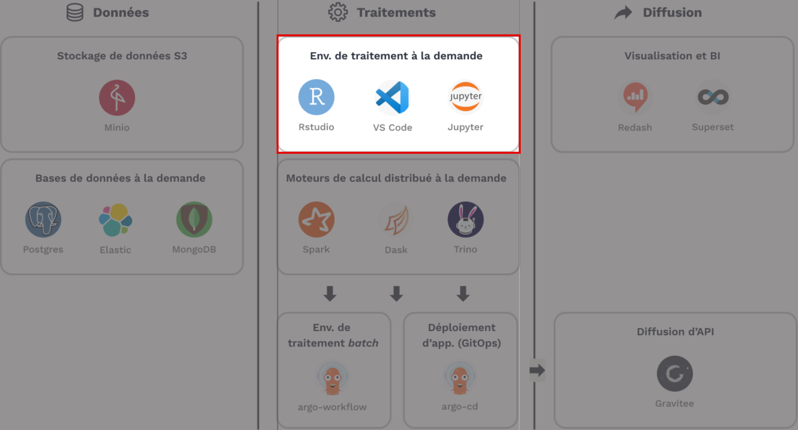
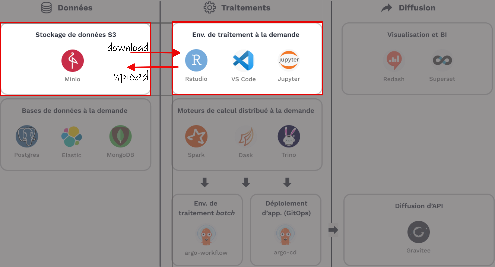
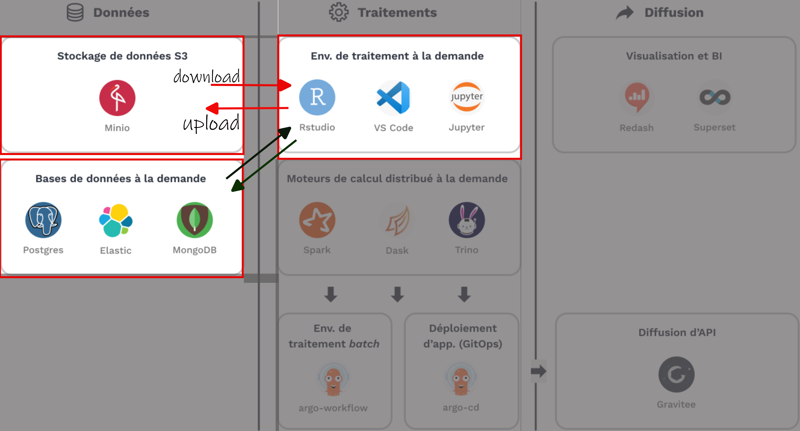
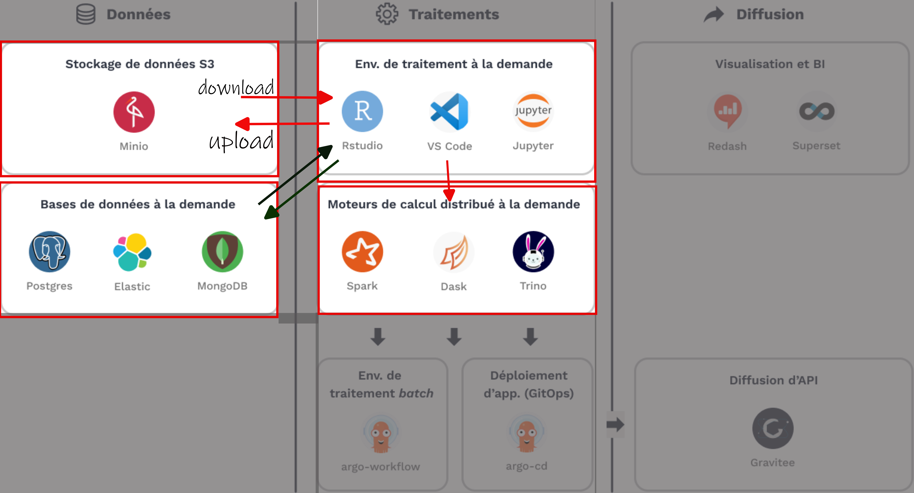

# The Funathon

## What is a Funathon? {.smaller}

A funathon is a special sort of event, halfway between a training session and a hackathon. It aims at giving statisticians an opportunity to __learn and apply machine learning and IA methods in a collaborative and supportive environment__. Over two days, participants will work in teams on end-to-end ML and AI projects provided by the organizers. Throughout the event, the organizing team will provide support to participants over Zoom whenever needed. All projects will be carried out on the (amazing) SSPCloud platform. 


:::: {.columns}

::: {.column width="70%"}

::: {.incremental}

- __[4 topics]{.blue2}__ to explore different areas of _data science_
    + Not a competition but [step-by-step tutorials]{.orange}
    + Feel free to try new things 😍 <br><br>
- [**_"Immediate takeoff for data science"_**]{.blue2}
    + Theme: statistics on civil aviation
    + Organization: WP6 and innovation teams from Insee <br><br>
- __Entry point__ : [aiml4os.github.io/funathon-general-website](https://aiml4os.github.io/funathon-general-website/)

:::

:::

::: {.column width="30%"}


:::

::::

::: {.callout-note collapse="true"}
## Last year's resources

All of last year's resources (_"From field to plate"_) can be found at [inseefrlab.github.io/funathon2023/](https://inseefrlab.github.io/funathon2023/)

:::

## What do projects consist in? {.smaller}

Funathon projects are end-to-end AI and ML projects demonstrating how to carry out a complex statistical task (codification, satellite imagery processing...).

::: {.incremental}

- Each project contains: [__data__]{.blue2}, [__code__]{.blue2}, complete technical [__configuration__]{.blue2}, detailed [__documentation__]{.blue2}, and exercises with hints and [__answers__]{.blue2}.
- Projects are [__well-suited for beginners__]{.orange} with minimal technical requirements.
- [__Detailed solutions__]{.orange} are included so that no one gets stuck.
- After the funathon, all projects will remain available on Github.

:::

## What will you learn? {.smaller}


- Discover [__AI and ML methods, tools and best practices__]{.orange};

. . .

- Work on [__real-life AIML use cases__]{.orange} relevant for official statistics.

. . .

- Get familiar with [__cloud-native work environments__]{.orange} such as SSPCloud.

## Requirements {.smaller}

The funathon is [__open to anyone__]{.orange} willing to develop skills in AI and ML.

. . .

This being said, you'll benefit more from the funathon if you have:

- a basic knowledge of [__Git__]{.orange} (`git clone`, `git pull`, `git push`...);
- a basic knowledge of [__Python__]{.orange};
- Some experience in ML and AI is not necessary (but useful, of course!).


## Schedule {.smaller}

The 2026 funathon will take place over two days, on [__May 27th and 28th__]{.orange}, from 9:30am to 5:30pm (UTC+1/CET):

. . .

- [__Welcome session__]{.blue2} (~30 min): organizers will explain and present the projects.

. . .

- [__Team work__]{.blue2} on one project over two days.

. . .

- [__Wrap-up session__]{.blue2} (~4:30pm on the second day): feedback and optional results presentation.

::: {.callout-note}
Presenting your results is **NOT** compulsory — the funathon is not a competition or an exam!
:::

## Registration {.smaller}

Registration is __compulsory__. Participants register in teams of approximately 3 to 5 people.

. . .

::: {.callout-important}
Organizers strongly recommend __booking a room__ to work together in-person — it's much more fun with colleagues!
:::

. . .

__Two-step process:__

- Register via the registration link (see the event webpage).
- Organizers will confirm your registration by email around [__May 15th__]{.orange}.

## Onboarding session {.smaller}

An onboarding session will take place on [Monday May 18th]{.orange} at 3:30pm (CET/GMT+1). 

## Frequently Asked Questions {.smaller}

::: {.incremental}

- __Can teams include people from different countries?__ Yes, but working in-person with nearby colleagues is strongly recommended.
- __Can I participate solo?__ Yes, but teams are more efficient and more fun.
- __Am I required to present my results?__ No, it is not compulsory.
- __What are the technical requirements?__ A Github account and an SSPCloud account. Some knowledge of Git and Python is useful but not mandatory.
- __Do I have to use SSPCloud?__ It is strongly recommended (technical support will only be provided on SSPCloud).
- __Can I use my own data?__ Yes, as long as it is open data (no confidential data is allowed on SSPCloud).

:::

## Practical details {.smaller}

- [__100% virtual event over 2 days__]{.blue2}:
    + [First day]{.orange}: introduction at __9:30am__ ;
    + [Second day]{.orange}: end of work on topics at __4:30pm__, then presentation and conclusion

. . .


- [__Support on Tchap and Zoom__]{.blue2} (links below 👇️):
    + Guaranteed assistance: 10am-5:30pm (except lunch 🍔) ;
    + Don't get stuck, [ask questions!]{.orange}


::: {.callout-note}
## Useful links

- [`Tchap` channel `Funathon 2024`](https://matrix.to/#/#funathon2024:agent.finances.tchap.gouv.fr)
- [`Zoom` channel](https://insee-fr.zoom.us/j/94735555913?pwd=dEtLQjg2Y1QrRzl3ei95dkRyOEVXdz09) over both days
:::

## The 4 topics {.smaller}

- [__ and  resources on *open data* from DGAC__]{.blue2} :
  + [2 topics]{.orange} allow you to use 
  + [3 topics]{.orange} allow you to use 
  + Technical levels indicated on the topics

. . .

- Complete tutorials __[with solutions]{.blue2}__
  + Look for the answer before checking the solution, it's the best way to learn!
  + Secondary goal: [__learn `Git`  and reproducibility__]{.blue2}


::: {.callout-note}
## More fun as a team 😺

Feel free to work on the topics as a team
:::

## The 4 topics

__Presentation of the 4 topics__

](img/sujets_funathon2024.png)


# What is SSP Cloud?


## An ideal environment for training {.smaller}

- Platform available at <https://datalab.sspcloud.fr/>
    + To discover and experiment...
    + ... **Only with open data**

. . .

- A platform for public administration:
    + Open to civil servants and data science training programs (ENSAE...)
    + Servers hosted at Insee

. . .

::: {.callout-important}

__Recommended platform for this event__

- Let us know if you cannot create an account!

:::

## An ideal environment for data analysis

{width=80%}

## Plus, SSP Cloud is amazing! 😍


__<https://datalab.sspcloud.fr>__


# Platform principles


## A platform for reproducibility and freedom {.smaller}

- You make a contract with `SSP Cloud` to create
an `RStudio` or `Jupyter` environment
    + It runs on remote servers
you access through your browser

. . .

- Initially [__standardized__]{.blue2} environment:
    + Everyone starts from the same minimal base
    + __Freedom__ to install packages or Linux libraries


. . .

- For Insee: same principle as the LS3 platform


## A platform for best practices {.smaller}

<details>
<summary>
In a different environment
</summary>


_Source_: [https://ensae-reproductibilite.github.io](https://ensae-reproductibilite.github.io/website/chapters/application.html)
</details>

- [__Temporary environments__]{.orange} therefore:
    + Store [__code__]{.blue2} in a permanent place: `Github`, `Gitlab`
    + Store [__data__]{.blue2} in a permanent place: `MinIO`


<details>
<summary>
In the context of the _Funathon_
</summary>

</details>

<details>
<summary>
For those who want to go (really) further
</summary>


_Source_: [https://ensae-reproductibilite.github.io](https://ensae-reproductibilite.github.io/website/chapters/application.html)
</details>


::: {.callout-note}
Services last several days but are __not meant to persist__
:::

## Standardized services to rule them all



## A persistent storage system for data



## When  or  are not enough

Special technologies for databases



## When  or  are not enough

Technologies suited for large-scale data




## Bonus

Statisticians who discovered `SSPCloud`, when they
have to go back to their usual infrastructure


# Onboarding

## _Checklist_

- [ ] Create an account
- [ ] Log in
- [ ] Find help
- [ ] Launch a _data science_ service (`R`, `Jupyter`...)
- [ ] Use `Git` 
- [ ] Use `MinIO` object storage


## Create an account

- Go to <https://datalab.sspcloud.fr> then `Login` and `Create an account`
    + Use an email address from an authorized domain ([@insee.fr]{.blue2}, [@..gouv.fr]{.blue2}...)
    + Domains [@gmail.com]{.blue2}, [@yahoo.fr]{.blue2}... not allowed
    + Only institutional domains are authorized (universities, schools, administrations...)

. . .

- If needed, ask us to add a domain


## Log in

- Go to <https://datalab.sspcloud.fr>
- Click on `Login`
    + Civil servants: the `AgentConnect` login is very convenient

## Find help

- Documentation: <https://docs.sspcloud.fr/>

. . .

- Training portal to bookmark ⭐️: <https://www.sspcloud.fr/formation>

. . .

- Ask questions on `Tchap` channels:
    + [`SSPCloud`](https://matrix.to/#/#SSPCloudXDpAw6v:agent.finances.tchap.gouv.fr) in general;
    + [`Funathon 2024`](https://matrix.to/#/#funathon2024:agent.finances.tchap.gouv.fr) during this event;

## Launch a _data science_ service

<https://docs.sspcloud.fr/onyxia-guide/premiere-utilisation>

- Each service has a `README`, [__read it 😉__]{.red2}

. . .

- Each service is protected by a password, __copy it__

. . .

- **Services** are **ephemeral**
    + **Use `Git`**  (with `Github`  or `Gitlab` ) to save your _notebooks_ and code
    + **Use `MinIO`** to save your data
    + __otherwise you might lose your work__


## Using `Git` 

<https://docs.sspcloud.fr/onyxia-guide/controle-de-version>

- Mandatory to avoid losing work (_notebooks_ and code)
- Essential for collaboration
- Compatible with your forge of choice (`GitHub`, `GitLab`...)
- Authentication _token_ (see below) can be stored on SSPCloud

## Using `MinIO` object storage

<https://docs.sspcloud.fr/onyxia-guide/stockage-de-donnees>

- To store your data as if you had a local file service
- Each user has a personal bucket
- Possibility to make data public
- `Python` libraries (`Boto3` or `S3Fs`) or `R` (`aws.s3`)

## Using `MinIO` object storage


## Launch a ready-to-use service

- An example with  ([Dashboard](https://github.com/InseeFrLab/funathon2024_sujet2))<br>

```{=html}
<a href="https://datalab.sspcloud.fr/launcher/ide/rstudio?version=1.15.25&autoLaunch=false&networking.user.enabled=true&git.repository=«https%3A%2F%2Fgithub.com%2FInseeFrLab%2Ffunathon2024_sujet2.git»&onyxia.friendlyName=«config-funathon2024»&kubernetes.role=«admin»" target="_blank" rel="noopener"></a>
```

- An example with `Python`  ([Text analysis topic](https://github.com/InseeFrLab/funathon2024_sujet4))

[](https://datalab.sspcloud.fr/launcher/ide/jupyter-python?version=1.13.36&autoLaunch=true&init.personalInit=«https%3A%2F%2Fraw.githubusercontent.com%2FInseeFrLab%2Ffunathon2024_sujet4%2Fmain%2Finit.sh»&init.personalInitArgs=«https%3A%2F%2Fgithub.com%2FInseeFrLab%2Ffunathon2024_sujet4.git»&onyxia.friendlyName=«funathon2024-sujet4»)

::: {.callout-warning}
## For the `Python` launch link
Don't forget to replace the pre-filled repository URL in the `Init` tab with your own (the URL of your _fork_)
:::

# `Git` : a few concepts

## Why use version control?

- [__Build__]{.blue2} and [__navigate__]{.blue2} through your project's [**history**]{.orange}

. . .

- [**Collaboration**]{.orange} made [__simple__]{.blue2} and [__efficient__]{.blue2}

. . .

- Improve the [**reproducibility**]{.orange} of your projects

. . .

- Improve the [**visibility**]{.orange} of your projects


::: {.callout-note}
More details in the [official training](https://inseefrlab.github.io/formation-bonnes-pratiques-git-R/)
:::


## Workflow

{fig-align="center" height=400}

- By default, the remote repository has the alias `origin`

## Additional resources {.smaller}

- To **go further**:
    - [Best practices training with `Git` and `R`](https://inseefrlab.github.io/formation-bonnes-pratiques-git-R)
    - [Introduction to `Git` for `Python`](https://pythonds.linogaliana.fr/exogit/)
    - The [`utilitR` documentation](https://www.book.utilitr.org/) has several chapters on `Git`
    - The [Bible](https://git-scm.com/book/en/v2) of `Git` usage


# Hands-on illustration with `RStudio` 🚀

## Objective {.smaller}

- Discover `S3`
- Discover `Git` through the `RStudio` interface
- Discover the interaction between `Git`, `RStudio` and `Gitlab`
- Get familiar with some `Git` concepts

. . .

- __[Recommended method for `Git`]{.blue2}__:
    + We suggest working on the same branch...
    + ... but on separate files.
    + Avoids using branches while limiting conflicts.


. . .

- **Find help**:
    - For any question: the Tchap room [Insee-Git-Gitlab](https://tchap.gouv.fr/#/room/#InseeGitGitlablPtu8f1Frns:agent.finances.tchap.gouv.fr)
    - At Insee: the [user documentation](https://gitlab.insee.fr/infrastructure/lss/ausv3/documentation-utilisateurs/-/wikis/Logiciels/Git) for using `Git` on `AUS`
    - Ask your colleagues who use `Git`!


## Demo 🚀

Example from [topic 2](https://github.com/InseeFrLab/funathon2023_sujet2)

```{=html}
<a href="https://datalab.sspcloud.fr/launcher/ide/rstudio?version=1.15.25&autoLaunch=false&networking.user.enabled=true&git.repository=«https%3A%2F%2Fgithub.com%2FInseeFrLab%2Ffunathon2024_sujet2.git»&onyxia.friendlyName=«config-funathon2024»&kubernetes.role=«admin»" target="_blank" rel="noopener"></a>
```


## `S3` cheat sheet

<details>
<summary>Examples from [utilitR](https://www.book.utilitr.org/01_r_insee/fiche_utiliser_rstudio_sspcloud#liens-utiles)
</summary>

```r
bucket <- "donnees-insee"
aws.s3::get_bucket(bucket, region = "")
df <-
  aws.s3::s3read_using(
    FUN = data.table::fread,
    # Put FUN options here
    object = "diffusion/FILOSOFI/2016/FILOSOFI_COM.csv",
    bucket = "donnees-insee",
    opts = list("region" = "")
  )
aws.s3::s3write_using(
  df,
  FUN = data.table::fwrite,
  # fread options go here
  sep = " ;",
  col.names = TRUE,
  object = "data/filosofi2016_example.csv",
  bucket = "MY_BUCKET_TO_REPLACE",
  opts = list("region" = "")
)
```
</details>

To list files in a _bucket_:

```r
bucket <- "projet-funathon"
aeroports <- aws.s3::get_bucket(bucket, region = "", prefix = "2024/sujet2/")
```

To read a file directly:

```r
bucket <- "donnees-funathon"
aeroports <- aws.s3::s3read_using(
  object = objets$Contents$Key,
  FUN = sf::st_read,
  bucket = bucket,
  opts = list(region = "")
)

library(leaflet)
leaflet(aeroports) %>% addTiles() %>%
  addMarkers(popup = ~Nom)
```


# Hands-on illustration with `Jupyter` 🚀

## Demo 🚀

Example with `Python`  ([Text analysis topic](https://github.com/InseeFrLab/funathon2024_sujet4))

[](https://datalab.sspcloud.fr/launcher/ide/jupyter-python?version=1.13.36&autoLaunch=true&init.personalInit=«https%3A%2F%2Fraw.githubusercontent.com%2FInseeFrLab%2Ffunathon2024_sujet4%2Fmain%2Finit.sh»&init.personalInitArgs=«https%3A%2F%2Fgithub.com%2FInseeFrLab%2Ffunathon2024_sujet4.git»&onyxia.friendlyName=«funathon2024-sujet4»)


## `S3` cheat sheet

See <https://pythonds.linogaliana.fr/content/modern-ds/s3.html>

## `Git`

See <https://pythonds.linogaliana.fr/content/git/exogit.html>

## Questions


## The funathon is underway

- You can join the breakout rooms on Zoom by topic
- You can ask your questions on Tchap

{width="30%" fig-align="center"}


## The funathon is underway (support on break)

- The assistants also need a coffee break

{width="30%" fig-align="center"}


## The funathon is underway (lunch break)

- Don't forget to eat

{width="30%" fig-align="center"}


